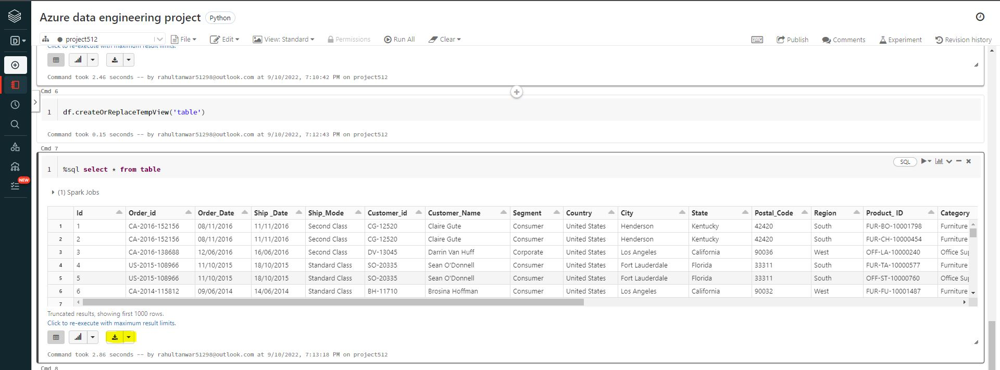

<h1 align="center">Azure Data Engineering Project</h1>
<h2 align="left">Business Use case: </h2>
<h3 align="left">We have data coming to azure blob storage in json format and we need to create pipeline which will be able to convert this file into csv format and store in output folder. we will mount our databricks to output container and need to do data cleaning operations there and convert into proper reporting formats and finally we will derive business metrics with the help of tableau.</h3>

<h2 align="left">High Level Steps:</h2>
<h3 align="left">

**1. Create blob storage in azure**

**2. Create data pipeline in azure data factory**

**3. Mount blob storage to databricks and perform cleaning using pyspark and spark sql**

**4. Tableau for visualization for business metrics**
</h3>

<h2 align="left">Prerequisite</h2>
<h3 align="left">

**- Azure account with active subscription**

**- Databricks community edition account**

**- Tableau public account**

**- Knowledge about storage account, dataframe, azure data factory, sql stc.**
</h3>

<h2 align="left">Complete Steps:</h2>
<h3 align="left">

**1. Input JSON file records format**

**2. Open Azure portal and Create one Blob Storage Account**

**3. Create two new containers : raw & target**

**4. Open raw container and upload Input JSON file in raw container.**

**5. Create Azure data factory and Open it to create new pipeline.**

**6. Create data factory pipeline so that we can convert our JSON input file to CSV file format. Also we have to add columns data for future purpose**

**7. After publishing all the changement in data factory, we have to trigger our pipeline and go to moniter tab to check pipeline status.**

**8. Check the target container. You will find superstore data in csv format if pipelines runs successfully.**

**9. After this Open databricks account and create one new cluster.**

**10. After creating new cluster , create one new workbook and mount our blob storage account in databricks**

**11.Use databricks to clean our dataset and get rid of unwanted data columns, NULL records etc.**

**12.Download the dataset once all data cleaning operation completed and you will find output file in csv format as below snapshot.**

**13. Open Tableau and load our dataset.**

**14. Create dashboard in it to find different kind of trends from our dataset as per business requirement.**

**To view this dashboard working please use below link**

**https://public.tableau.com/views/SuperStoreSalesDashboard_16628219761960/Dashboard1?:language=en-US&:display_count=n&:origin=viz_share_link**

